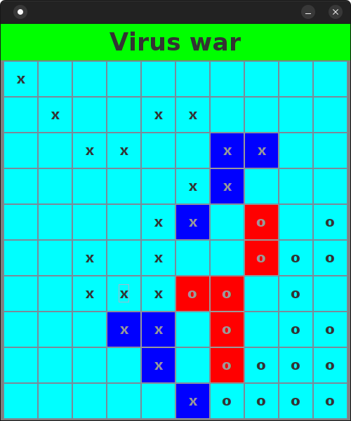

<h1>Virus Wars</h1>
Simple game with GUI.

<h3>Description</h3>

This is a simple GUI game where you play against an algorithm.

In each round, the player has three moves. When a player makes a move, the cell receives the player's symbol.

If a player steps on a cell that already has the opponent's symbol, the cell is painted in the player's color, becoming the player's cell forever. The opponent can no longer step on it.

A player can only move to a cell adjacent to their own.

The game ends when one of the players runs out of moves.

<h3>Technologies:</h3>
- java core;
- gui: Swing;
- Maven.

<h3>Building</h3>
You can use maven for project building or open it in Intellj Idea.

Build with maven command:

``mvn build``

<h3>Run</h3>
Just execute VirusWars.exe file.
